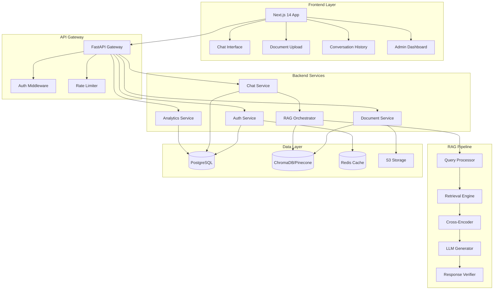

# Design Document

## Overview

The Enterprise RAG 2.0 Chat Application is a production-ready AI-powered knowledge management system that combines a modern Next.js frontend with a sophisticated Python FastAPI backend. The system implements advanced Retrieval-Augmented Generation (RAG) techniques including multi-stage retrieval, query understanding, and self-correction loops to provide accurate, verifiable answers from enterprise document repositories.

The architecture follows a microservices-ready design with clear separation of concerns, enabling independent scaling and deployment of components. The system supports multi-tenancy with complete data isolation, enterprise-grade security, and white-label customization capabilities.

## Architecture

### High-Level System Architecture

### Technology Stack

**Frontend:**
- Next.js 14 with App Router and React Server Components
- TypeScript for type safety
- Tailwind CSS for styling
- Axios for API communication
- Lucide React for icons
- React Query for state management and caching

**Backend:**
- Python 3.11+ with FastAPI
- SQLAlchemy 2.0 for ORM
- Alembic for database migrations
- Pydantic v2 for data validation
- Python-Jose for JWT handling
- Passlib for password hashing

**RAG Stack:**
- LangChain for RAG orchestration
- Sentence Transformers for embeddings
- Cross-Encoder (BAAI/bge-reranker-large) for reranking
- OpenAI API / Anthropic API for LLM
- ChromaDB for vector storage (MVP)
- Pinecone/Qdrant for production vector storage

**Document Processing:**
- PyPDF2 and pdfplumber for PDF parsing
- python-docx for Word documents
- python-pptx for PowerPoint
- openpyxl for Excel files
- BeautifulSoup4 for HTML parsing
- LangChain text splitters for chunking

**Infrastructure:**
- PostgreSQL 15+ for relational data
- Redis 7+ for caching and sessions
- AWS S3 / Google Cloud Storage for file storage
- Docker for containerization
- Kubernetes for orchestration (production)

## Components and Interfaces

### Frontend Components

#### 1. Chat Interface Component
